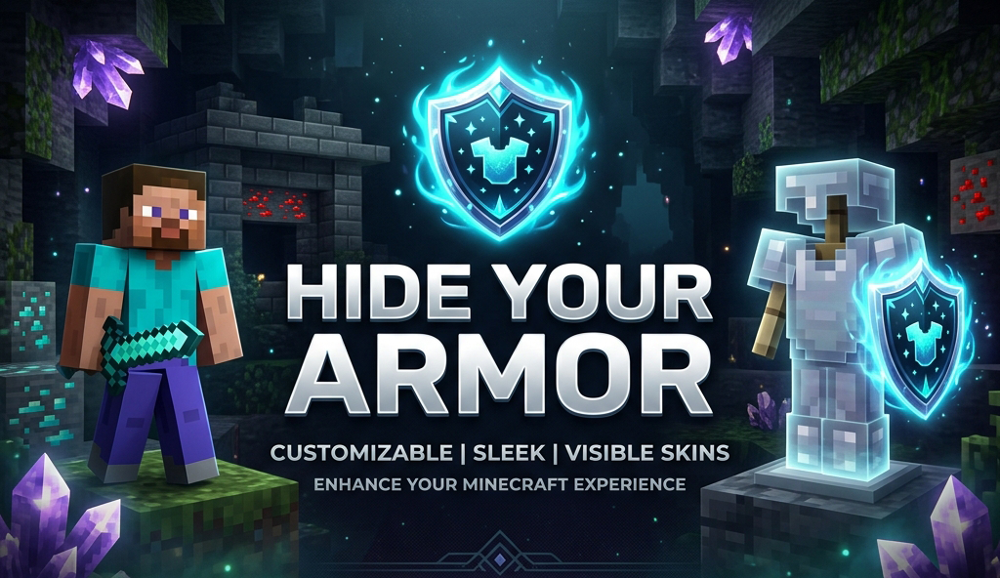

#  Hide Your Armor

  

  
  
  
  

Client-side mod for hiding or fading your armor. Works locally by default, and optionally syncs to other players if the server has it too.

---

## Features

**Opacity, not just on/off**
Every piece has a slider from 0% to 100%. Drag it and see the change instantly on the preview doll. No need to re-equip anything.

* **Armor** – Helmet, Chestplate, Leggings, Boots each have their own slider
* **Shield** – Off-hand shield opacity
* **Misc** – Elytra, Skulls & blocks worn on head, Capes, and Armor trims
* **Enchantment glint** – Toggle the glint separately for each armor piece and the shield

  

**Three tabs**
Armor / Offhand / Misc. Misc uses the map icon – that's where the elytra/cape/trim stuff lives.

**Live preview**
The config screen doesn't pause the game. You can spin the preview model and it updates in real time. Settings save to `config/hidearmor.json` when you close the screen.

**Presets**
Save your current sliders as a preset and apply it later. Right-click a preset to delete it.

**Wildfire Female Gender Mod compat**
If you use WGFM, breast armor layers follow your chestplate opacity and the glint toggles work on those meshes too.

---

## Controls

* **H** – open Hide Your Armor (rebindable in Controls)
* While the screen is open: drag sliders, toggle glint, switch tabs. Hit `Esc` to close and save.

---

## Multiplayer

The mod is client-side only. You can join vanilla servers fine – your settings just stay local.

If you want others to see you the way you configured it, turn on **Multiplayer Sync** (compass icon in the top-right of the config screen). When enabled, your config is sent to the server and the server relays it to other players who also have the mod.

| You | Server | Others see your opacity? |
| :--- | :--- | :---: |
| Singleplayer / LAN | – | Yes |
| Modded server | Mod installed | Yes |
| Vanilla / no mod | Not installed | No – stays local |

Players without the mod just see normal armor. No crashes or desyncs.

---

## Installation

Universal jar works on both loaders (built with Architectury + Forgix).

1. **Fabric:** Minecraft 26.3 + Fabric Loader + Fabric API
2. **NeoForge:** Minecraft 26.3 + NeoForge 26.3.0.10-beta or newer

Download `HideYourArmor-1.7.0-universal.jar` from [Releases](https://github.com/G10W5/Hide-Your-Armor/releases) and drop it in `mods/`.

Fabric API is required on Fabric. No extra dependencies on NeoForge.

---

## Config & Commands

No commands. Config lives at `config/hidearmor.json` and is edited in-game. You can back it up or delete it to reset.

---

## License

MIT – see [LICENSE](LICENSE).
